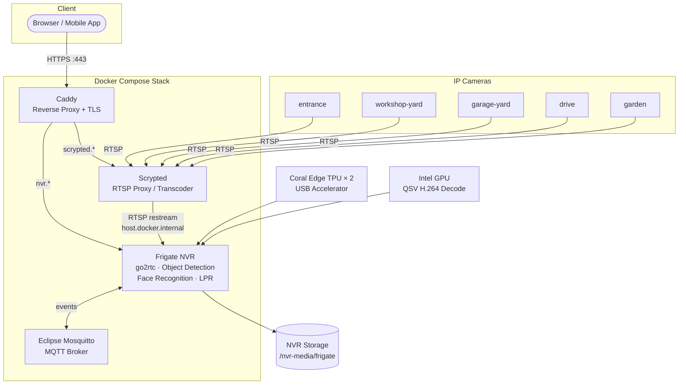

# home-nvr-detection

This project contains the software configuration for my home NVR/ML/TPU accelerated object detection system. Largely built on [Frigate](https://frigate.video/).

## Architecture

## Requirements

* Docker
* Docker Compose
* [Coral Edge TPU USB Accelerator](https://coral.ai/)

## Steps

### 1. Configure the `.env` file with your environment variables

`cp .env.example .env`

Edit the `.env` file to set your environment variables.

### 2. Generate the Mosquitto password file

Generate the Mosquitto password file with the following command:

`docker-compose run --rm mqtt mosquitto_passwd -c /mosquitto/mosquitto.passwd ${FRIGATE_MQTT_USER}`

This will prompt you to enter a password for the MQTT user specified in the `.env` file. This will create the `mosquitto.passwd` file with the appropriate credentials for MQTT authentication, which is used by both the MQTT and Frigate containers.

### 3. Deploy the stack

`docker-compose up -d`

This will deploy the required Frigate, MQTT and Caddy reverse proxy servers. Note, you must replace all the `"CHANGE_ME"` values to valid production ones in the `.env` file before deploying, and setup the MQTT password file. The USB Coral TPU must be connected to system too.
